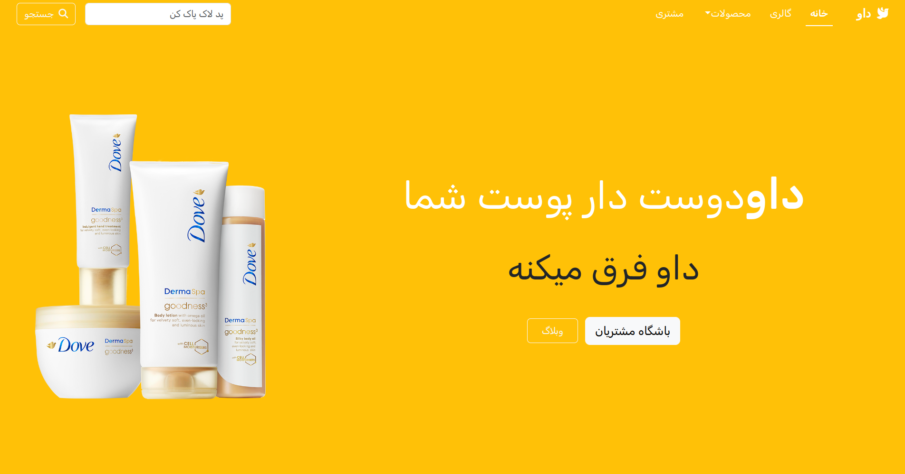
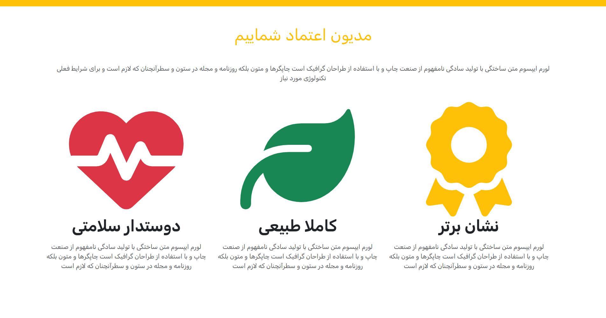

# :fire::fire: Responsive Home Page for the Dove :fire::fire:

this a Home page of Dove that is powered by Bootsrap and it is totally responsive 

**Section:**

- Nav Bar
- Brand
- Feature
- Product
- Blog
- Contact
- Footer

## Dashboard

employees has dashboard where they can create job,update and delete it, they can see the applicants for the job and
shortlist (in this case a notification email send to user) them or delete them.
<table>
<tr>
    <td></td>
    <td></td>
    <td></td>
  </tr>
 <tr>
    <td></td>
    <td></td>
    <td></td>
  </tr>
 </table>

## :technologist: Technologies Used :technologist:

 <ul>
    <li>Html</li>
    <li>Css</li>
    <li>Js</li>
    <li>Bootstrap</li>
    <li>blade template</li>
</ul>
